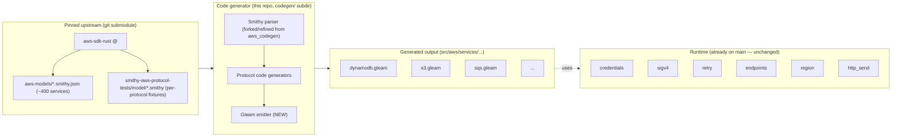

# M5+ pivot: codegen, not hand-craft

This document supersedes the M5–M7 section of `docs/v0.1-plan.md`. The
runtime work (M1 SigV4, M2 credentials, M3 region+endpoint, M4 retry) stays
exactly as merged on `main`. What changes is everything above the runtime:
protocol codecs, typed clients, and per-service code are now **generated**
from upstream Smithy models instead of hand-written.

## Why pivot

A look at `aws_codegen` (an existing project authored in Gleam by
ryanmiville) revealed that the most expensive parts of an SDK generator
already exist as reusable Gleam code:

```
aws_codegen/
  src/smithy/        ← Smithy JSON model parser (service, shape, trait, …)
  src/codegen/       ← protocol-aware code generation
    json_post.gleam     (awsJson 1.0 / 1.1)
    query_post.gleam    (awsQuery / ec2Query)
    rest.gleam          (restJson1 + restXml)
    operation.gleam, parse.gleam, module.gleam
  src/aws_api/       ← emitter — currently writes Elixir for ryanmiville/aws_api
  aws-models/        ← 385 vendored Smithy JSON service models
```

The Smithy parser, the protocol classifier, and the operation modeling
are service-agnostic and target-agnostic. Only the **emitter** is
Elixir-specific. Adding a Gleam emitter alongside `src/aws_api/` (call it
`src/aws_gleam/`) is the entire delta.

The leverage is enormous. Hand-writing codecs for 8+ AWS protocols against
385 services is several weeks of mechanical work. Generating them, after
~2 weeks of emitter work, gives us **every service AWS publishes** and
makes "pull the latest model" a one-line refresh.

## Architecture



Concretely:

1. `aws-sdk-rust` is added as a git submodule at a pinned commit. We get its
   `aws-models/*.json` (Smithy AST), its `aws-models/sdk-partitions.json`,
   AND its `smithy/smithy-aws-protocol-tests/model/*` test fixtures in one
   pinned bundle.
2. The codegen lives in `codegen/` in this repo (separate `gleam.toml`).
   It reads from the submodule, writes Gleam files into
   `src/aws/services/<service>/`.
3. Generated code calls into the existing runtime modules — `aws/credentials`,
   `aws/region`, `aws/endpoints`, `aws/internal/sigv4`, `aws/internal/http_send`,
   `aws/retry`. No new runtime is needed.
4. Updating the submodule pulls fresh models; re-running codegen refreshes
   every service.

### Where the source lives

`aws-sdk-rust/aws-models/*.json` is the *richest* single source: Smithy AST
form, paired with endpoint rule sets and partitions, kept current by the
AWS Rust SDK team, with a clear commit history. Pinning to its SHA makes
"what version of AWS were we built against?" a single git ref.

The smithy-rs repo also publishes the protocol-test models. We get those
via the same submodule (`aws-sdk-rust` vendors them at
`smithy/smithy-aws-protocol-tests/`) or, if not, via a parallel submodule
of `smithy-rs` at a pinned commit.

### Why submodule, not vendor-as-checked-in-files

- Reproducibility: anyone can `git submodule update --init` and reproduce
  the build at the pinned SHA.
- Update UX: `git submodule update --remote` bumps to a new upstream
  commit; a regen run refreshes generated code.
- Repo size: 385 service models is ~50 MB. Keeping it as a submodule keeps
  our main repo lean.
- The submodule's contents are still pinned to a SHA recorded in our git
  history; "what models did this release ship against?" is `git submodule
  status`.

Downsides (worth naming): contributors who clone forget `--recursive`
sometimes; CI needs the right checkout flag. Both standard and well-
documented friction.

## Test strategy — what survives, what changes

| Test corpus | Status now | Status under pivot |
|---|---|---|
| SigV4 vectors (38 cases × 4 stages) | vendored, M1 green | unchanged — runtime tests |
| Endpoint rule-set fixtures (763 cases) | vendored, M3 green | unchanged — runtime tests |
| Credential providers + cache (37 cases) | unit-tested, M2 green | unchanged |
| Retry middleware (23 cases) | unit-tested, M4 green | unchanged |
| Smithy protocol-test fixtures | not yet vendored | **vendored via submodule**; codegen runs them against generated code |
| LocalStack integration | not started | M6 — DynamoDB GetItem + S3 GetObject |
| Live AWS smoke | one-off script | M6+ — gated CI step with `AWS_PROFILE` |

The 153 tests we have stay valuable: they validate the **runtime** that
generated code calls into. The protocol-test fixtures we were about to
hand-extract instead get parsed directly from the Smithy IDL by the
codegen (Smithy IDL → JSON AST is `smithy build` or similar), and run
against the generated code per service.

## Detailed test plan

The codegen pivot adds at least three new test layers on top of the
runtime tests already on `main`. Each layer has its own corpus, its own
runner, and its own definition of "green". This section spells them out
so there's no ambiguity at audit time.

### Layer 1 — Runtime (already on `main`, untouched)

**Corpus** — 153 cases across SigV4 vectors, endpoint rule sets,
credential providers + cache, retry middleware. Lives under
`test/fixtures/` and per-module `*_test.gleam` files.

**Runner** — `gleam test`.

**Green bar** — 100% pass. CI fails on any regression.

**What changes under pivot** — nothing. Generated code calls into
this runtime; if a generated client misbehaves, we want the runtime
tests to be a known-good baseline so we can isolate the regression to
codegen.

### Layer 2 — Smithy protocol-test conformance (new in M5)

This is the headline new test corpus, the thing that makes "we are 1:1
with the Rust SDK" testable rather than asserted.

**Corpus** — `smithy-aws-protocol-tests` model files: per-protocol
Smithy IDL declaring `@httpRequestTests` and `@httpResponseTests` on
operations. Six protocols of interest:

| Protocol | Approx case count | Source path |
|---|---|---|
| awsJson1_0 | ~70 | `model/aws-json-10/main.smithy` |
| awsJson1_1 | ~120 | `model/aws-json-11/main.smithy` |
| restJson1 | ~270 | `model/rest-json/*.smithy` |
| restXml | ~280 | `model/rest-xml/*.smithy` |
| awsQuery | ~80 | `model/aws-query/*.smithy` |
| ec2Query | ~50 | `model/ec2-query/*.smithy` |

Counts are approximate (drift with upstream); the corpus auto-grows as
we bump the submodule.

**Acquisition** — pinned in the `vendor/aws-sdk-rust` submodule (or a
parallel `vendor/smithy-rs` submodule if aws-sdk-rust doesn't carry the
fixtures at the SHA we pin). No fixture is hand-written or hand-edited.

**Ingestion** — protocol-test models are Smithy IDL, not JSON AST. We
need them in JSON AST form to feed the existing aws_codegen parser. Two
options, pick one per audit:

1. Run `smithy build` at codegen time (requires Java, but ~30s one-off).
2. Find a pre-compiled JSON snapshot inside aws-sdk-rust's build outputs.
   smithy-rs caches the AST during its own codegen — `find vendor/aws-sdk-rust
   -name '*.smithy.json' -path '*protocol-tests*'` will tell us.

Default to (2) if it exists, fall back to (1). Either way, the JSON AST
becomes the runner's input.

**Runner** — new module `test/protocol_tests/runner.gleam`. For each
case:

- **httpRequestTests** — build the request via generated client code,
  then assert: HTTP method matches, URI matches, query string matches
  (order-insensitive per Smithy spec when `requireQueryParams` is
  empty), headers match (case-insensitive, `forbidHeaders` /
  `requireHeaders` enforced), body matches (exact bytes for binary
  protocols, semantic JSON equality for awsJson / restJson, semantic
  XML equality for restXml).
- **httpResponseTests** — feed the canned response bytes through the
  generated deserializer, assert the resulting struct equals the
  expected one (Gleam structural equality).

**Green bar per protocol** — every case in the upstream corpus is one
of:

- **Pass** — generated code produced the expected output.
- **Skip — known upstream issue** — explicit allow-list with a comment
  pointing to the upstream issue. No silent skips.
- **Skip — unsupported feature in this milestone** — explicit
  allow-list, scheduled into a later milestone. Capped per protocol
  and reviewed each milestone end.
- **Fail** — bug. Must be fixed before milestone closes.

A protocol is "green" when every case is in one of the first three
categories AND the skip list does not grow milestone-over-milestone
without a written justification.

**No artificial threshold lowering.** If a case fails, we either fix
it, justify the skip in the allow-list, or do not call the milestone
done. Per the existing CLAUDE.md verification policy.

### Layer 3 — Generator self-tests (new in M5)

The emitter itself is code; it needs its own tests.

**Snapshot tests** — for each protocol we support, a small "golden"
Smithy model in `codegen/test/fixtures/snapshots/<protocol>/in.smithy.json`
gets fed through the generator. The output is compared against
`codegen/test/fixtures/snapshots/<protocol>/expected.gleam` byte-for-byte.

When the emitter intentionally changes shape, regenerate the goldens
with `gleam run -m codegen/test/snapshots --update` and code-review the
diff. Snapshot diffs ARE the review surface for emitter changes; no
quiet rewrites.

**Parser tests** — assert the (vendored) Smithy parser handles every
shape kind, trait, and operation pattern we hit in production models.
Driven by sampling random shapes from the 385 vendored AWS service
models — if it parses every shape AWS publishes, it parses ours.

**Compile-and-format check** — after emitting each service file, run
`gleam build` and `gleam format --check` on it. Generator output that
doesn't compile or formats dirty is a failed run. Wired in
`codegen/src/main.gleam` as a post-emit step.

### Layer 4 — LocalStack integration (new in M6)

Per the existing CLAUDE.md: "LocalStack-backed tests for DynamoDB
`GetItem` and S3 `GetObject`, spun up via `testcontainers` from `gleam
test`."

**Corpus** — at least these two operations, expanded as we add
services. Each test seeds LocalStack (PutItem / PutObject), then runs
the generated read op, then asserts the round-trip.

**Runner** — `gleam test` with `testcontainers` (via FFI to
`testcontainers-erlang` if such a thing exists, or a thin wrapper that
shells out to `docker` — decided in M6).

**Green bar** — 100% pass when Docker is available; cleanly skipped
with a printed reason when it is not. CI: a job runs with Docker
available; the per-developer `gleam test` does not require Docker.

### Layer 5 — Live AWS smoke (new in M6, gated)

Per CLAUDE.md: "Live AWS smoke suite is gated on `--include live` and
`AWS_PROFILE` being set."

**Corpus** — one read operation per priority service:

| Service | Smoke op | Notes |
|---|---|---|
| DynamoDB | ListTables | Cheapest, no resource needed |
| S3 | ListBuckets | Same |
| SQS | ListQueues | |
| SNS | ListTopics | |
| Lambda | ListFunctions | |
| ECS | ListClusters | Fargate substrate |
| RDS | DescribeDBInstances | |
| EC2 | DescribeRegions | Read-only, no instance |
| SES | ListIdentities | |

**Runner** — `gleam test --include live` (gated by env check inside
the test module — `aws_ffi:get_env("AWS_PROFILE")`).

**Green bar** — every operation returns HTTP 200 (or a documented
no-permissions 403, recorded with the AWS error code). Not run on PR
CI; run on demand and at release time.

### Drift audit per milestone

End every milestone with the audit ritual from the saved feedback
memory:

1. **Inventory parity** — for the milestone's scope, list every named
   feature in the Rust SDK and check whether ours has it. Output the
   parity table into the milestone's drift-audit comment in the PR.
2. **Behavioural parity** — pick three protocol-test cases per protocol
   from Layer 2 and walk the wire bytes through both implementations
   (Rust as reference, ours under test). Any byte-level deviation is
   either a documented intentional deviation or a bug.
3. **Save findings** — anything that requires re-reading the Rust source
   to understand goes into a milestone-scoped audit file under
   `docs/audits/m<N>.md`. Future agents read those before changing the
   area.

### CI gating

| Job | Trigger | Layers | Required to merge |
|---|---|---|---|
| Format check | every push | – | Yes |
| Runtime tests | every push | 1 | Yes |
| Protocol tests | every push | 2 | Yes |
| Generator tests | every push | 3 | Yes |
| LocalStack integration | nightly + on `integration` label | 4 | No, but blocks releases |
| Live AWS smoke | manual + at release tag | 5 | No, but blocks releases |

No `--no-verify`, no skipped suites without an explicit and reviewed
allow-list entry. Layer 1+2+3 are the everyday green bar; Layer 4+5
gate releases.

## Re-planned milestones

### M5 — Generator foundation

- `codegen/` subproject scaffolded with its own `gleam.toml`.
- Submodule `vendor/aws-sdk-rust` pinned to a recent commit.
- Generator pipeline:
  1. Load Smithy JSON for one service (start with DynamoDB).
  2. Emit a Gleam module `src/aws/services/dynamodb.gleam` with typed input,
     typed output, per-op error sum, and an `invoke` function that
     composes our runtime.
  3. Verify the file compiles and `gleam format`s cleanly.
- Smithy protocol-test fixtures vendored. Test harness parses them and runs
  the generated DynamoDB ops against them.
- Drift audit at the end: compare emitted code against the Rust SDK's
  generated DynamoDB code, function-for-function, structurally where the
  language allows.

Deliverables:
- `codegen/src/...` — Gleam emitter
- `vendor/aws-sdk-rust/` — git submodule
- `src/aws/services/dynamodb.gleam` — first generated service
- `test/protocol_tests/` — fixture-driven tests over generated code
- One `gleam run -m aws/examples/dynamodb_get_item` smoke test

### M6 — Expand to the priority services

Generate the user's priority list: SQS, SNS, SES, S3, RDS, Lambda, Fargate
(ECS), EC2, DynamoDB. Per protocol coverage:

| Service | Protocol | Notes |
|---|---|---|
| DynamoDB | awsJson1_0 | M5 anchor |
| Lambda | restJson1 | |
| Fargate (ECS) | awsJson1_1 | |
| SQS | awsJson1_0 (new) | also has awsQuery legacy mode |
| SNS | awsQuery | legacy protocol — wider scope |
| SES (v2) | awsJson1_1 | v1 is awsQuery — covered by SNS work |
| RDS | awsQuery | legacy |
| EC2 | ec2Query | distinct protocol |
| S3 | restXml | |

Order: awsJson1_0 → restJson1 → awsJson1_1 → restXml → awsQuery → ec2Query.
Each protocol gets its emitter once; new services in the same protocol are
re-runs of codegen.

Verification:
- Protocol-test fixtures pass per protocol.
- LocalStack integration tests for DynamoDB `GetItem` and S3 `GetObject`.
- Live AWS smoke test gated on `AWS_PROFILE`.

### M7 — Polish, waiters, paginators

- Smithy `@paginated` trait → Gleam stream / lazy list.
- Waiters where Smithy defines them.
- Error model polish (richer typed errors per service).
- CI: pin a `vendor/aws-sdk-rust` commit, gate freshness ("model snapshot
  is N commits behind upstream — bump").

## Mechanics: keeping `aws_codegen` vs vendoring its parser

Two options for where the Gleam emitter lives:

1. **In-repo subproject** (`codegen/`): vendor a copy of `aws_codegen`'s
   parser + protocol generators into our repo, add a new emitter
   alongside. Pros: full control, no external dependency. Cons: we
   maintain a fork.
2. **Upstream contribution**: PR a Gleam emitter back to ryanmiville's
   `aws_codegen`. Pros: shared maintenance with the existing
   community. Cons: review latency, less control.

I lean **(1) in-repo** for now, with a clear note in the codegen subproject
that we're tracking aws_codegen's parser/protocol code and would
contribute the Gleam emitter back once it's mature. Speeds iteration.

## Open questions for you

1. **Submodule vs vendored snapshot.** Submodule is more rigorous; vendor
   (copy files into the repo, track upstream SHA in a manifest) is simpler
   for new contributors. Default to submodule unless you'd rather avoid
   the `git submodule update` friction.
2. **In-repo codegen subproject vs separate repo.** In-repo couples the
   generator to the generated code's review; separate repo is cleaner but
   adds release coordination. I'd default to in-repo until M7, then split.
3. **Protocols to target first** in M5. Default: DynamoDB / awsJson1_0
   (smallest scope, anchors the v0.1 promise). Confirm or override.
4. **Where to publish generated services.** All under `src/aws/services/`
   keeps everything in one package; alternative is one Gleam package per
   service (more work but more idiomatic for hex.pm).
5. **How aggressively to track upstream.** Manual bumps on demand, vs a
   scheduled CI job that opens a PR when upstream moves? Both work; I'd
   start with manual bumps.

## Discarded plan

The hand-crafted M5 work on `feat/m5-protocols` (`aws_json` codec module +
its tests) is stashed locally. Useful as reference for what the emitter
should produce, but not a path forward — the codegen approach subsumes it.

The previous M5–M7 sections of `docs/v0.1-plan.md` are superseded by this
document for protocol/codec/client work. Runtime sections (M1–M4) of that
plan remain accurate and reflect what's on main.
