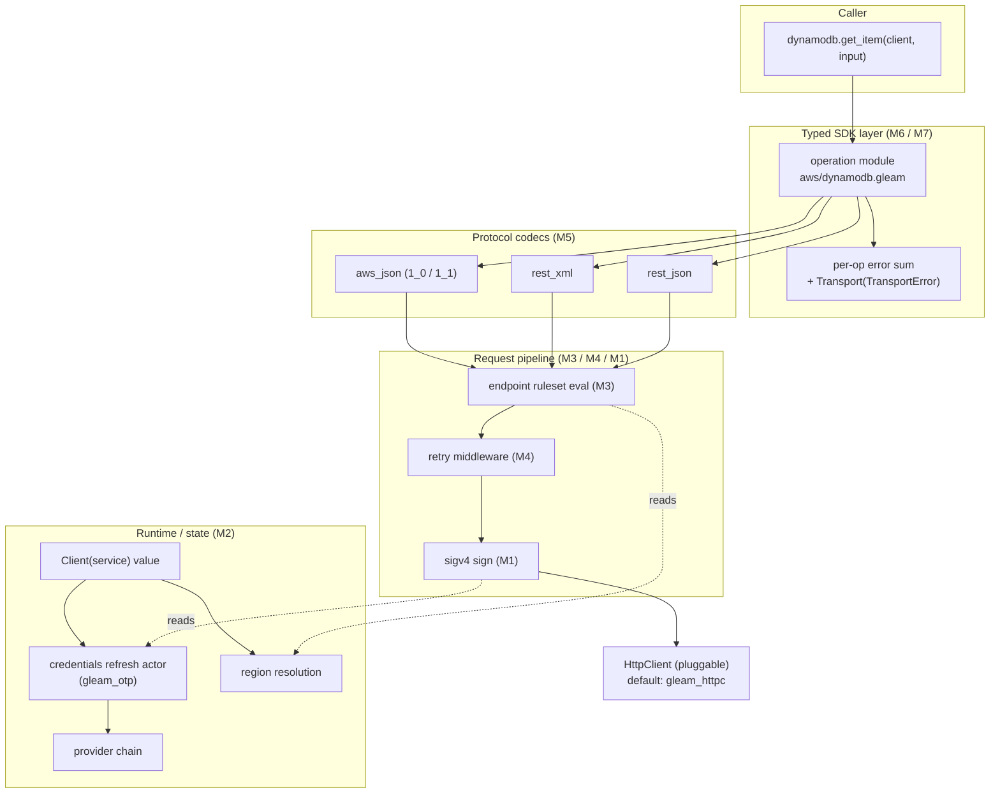

# AWS SDK for Gleam — v0.1 plan

## Context

The repository today is empty scaffolding: `CLAUDE.md`, an empty `test/fixtures/aws-c-auth/`, and a `test/fixtures/protocol-tests` symlink that points at `/Users/endreulberg/...` and does not resolve in CI or this remote container. No `gleam.toml`, no `src/`, one commit on `main`. Toolchain in this environment: Docker present, Gleam/Erlang absent (relevant for the session-start hook, not the plan itself).

Goal for v0.1: a Gleam binary dropped into Lambda / ECS Fargate / EC2 / EKS resolves creds + region + endpoint with zero configuration, then calls DynamoDB `GetItem` and S3 `GetObject` end-to-end with typed inputs / outputs / per-operation error sums. Scope and architecture priors are fixed by the prompt; this plan does not reopen them. Per the user, **planning is approved through Milestone 1 only** — milestones 2–7 are scoped here for review but execution stops at the M1 gate.

This document covers: (1) milestone-level deliverables with concrete file paths, (2) the verification harness design, (3) design questions to answer before M2, (4) scope items I think are wrong or under-specified.

## Shape of the system



The runtime (M1–M4) is built and verified before any service layer (M5–M6) exists. Codegen (M7) only emits what M6 has stabilized by hand.

## Repository layout target

```
gleam.toml                           # target = "erlang"
src/aws.gleam                        # top-level re-exports
src/aws/client.gleam                 # Client(service), aws.start_link/1
src/aws/dynamodb.gleam               # M6
src/aws/s3.gleam                     # M6
src/aws/internal/
  sigv4.gleam                        # M1
  http_request.gleam                 # internal request type used by signer + codecs
  credentials.gleam                  # types + Provider trait-shape
  credentials/{env,profile,sso,web_identity,ecs,imds,process,chain,refresh}.gleam   # M2
  region.gleam                       # M3
  endpoints.gleam                    # M3 evaluator
  endpoints/{parser,eval}.gleam      # M3
  retry.gleam                        # M4
  retry/{token_bucket,classifier}.gleam   # M4
  protocol.gleam                     # shared (M5)
  protocol/{aws_json,rest_xml,rest_json}.gleam   # M5
test/aws_test.gleam                  # gleeunit entry
test/aws/internal/...                # mirrors src/ layout
test/support/{localstack,mock_http,fixtures}.gleam
test/fixtures/aws-c-auth/...         # submodule, see "Vendoring"
test/fixtures/protocol-tests/...     # submodule, see "Vendoring"
test/fixtures/endpoints/...          # extracted endpoint-rule-set JSONs
scripts/{vendor_fixtures.sh,gen_sigv4_tests.sh,gen_protocol_tests.sh}
```

## Milestones

Each milestone ends with its verification gate green before the next one starts. **Execution is approved for M0 + M1 only.** M2–M7 are scoped here for review.

### M0 — Scaffold + verification harness skeleton (prereq, not in user's list but required)

Without this, "verification harness must be in place before any service code is written" can't be enforced.

Deliverables:
- `gleam.toml` with `target = "erlang"`, dependencies: `gleam_stdlib`, `gleam_otp`, `gleam_erlang`, `gleam_http`, `gleam_httpc`, `gleam_json`, `simplifile`, `gleeunit` (dev), `mist` (dev, for mock HTTP servers).
- `test/aws_test.gleam` entry that calls `gleeunit.main()`.
- `scripts/vendor_fixtures.sh` — replaces the broken symlink. Two git submodules pinned by SHA:
  - `test/fixtures/aws-c-auth/` ← `awslabs/aws-c-auth` (we only need `tests/aws-sig-v4-test-suite/`; sparse-checkout that subdir).
  - `test/fixtures/protocol-tests/` ← `smithy-lang/smithy` (sparse-checkout `smithy-aws-protocol-tests/model/`).
- `scripts/gen_sigv4_tests.sh` and `scripts/gen_protocol_tests.sh` — see "Verification harness" below.
- `test/support/mock_http.gleam` — minimal mist-based loopback server that returns canned responses keyed by request path. Used by M2 provider tests and (later) by retry tests.
- `test/support/localstack.gleam` — starts/stops a LocalStack container via `os:cmd("docker compose ...")` against `test/support/docker-compose.yml`, returns `Container { endpoint: String, stop: fn() -> Nil }`.
- A README provenance note in each `test/fixtures/*/VENDOR.md` recording upstream SHA and refresh procedure.

Gate: `gleam test` runs (zero tests is fine), submodules check out cleanly, `test/support/localstack.gleam` starts and stops a container in CI.

### M1 — SigV4 signing **[execution approved through here]**

Files:
- `src/aws/internal/http_request.gleam` — `HttpRequest { method, scheme, host, path, query: List(#(String, String)), headers: List(#(String, String)), body: BodyKind }` where `BodyKind = Empty | Bytes(BitArray) | Unsigned`.
- `src/aws/internal/sigv4.gleam` — three layered public-within-crate functions matching the AWS spec's three steps, plus a top-level wrapper:
  - `canonical_request(req: HttpRequest) -> String`
  - `string_to_sign(canonical: String, ts: Timestamp, scope: Scope) -> String`
  - `signing_key(secret: String, scope: Scope) -> BitArray` (date → region → service → "aws4_request", cached via the refresh actor in M2; M1 ships an uncached version)
  - `sign(req, creds, ts, scope) -> HttpRequest` — adds `Authorization`, `X-Amz-Date`, `X-Amz-Security-Token` (if session), `X-Amz-Content-Sha256` (for S3 unsigned-payload).
- `test/aws/internal/sigv4_test.gleam` — hand-written sanity case (one well-known vector) so the harness compiles even before generation.
- `test/aws/internal/sigv4_generated_test.gleam` — **generated** by `scripts/gen_sigv4_tests.sh` from the vendored vector tree; one `pub fn <case>_canonical_request_test()`, `..._string_to_sign_test()`, `..._authorization_test()` per case. Checked into git so `gleam test` is hermetic.

Gate: every vector in `aws-sig-v4-test-suite/` passes all three step assertions. No exemptions.

### M2 — Credential providers + chain + refresh actor

Files:
- `src/aws/internal/credentials.gleam` — `Credentials { access_key_id: String, secret_access_key: String, session_token: Option(String), expiry: Option(Timestamp) }`; `Provider` modeled as a record-of-functions (not a behaviour, since we want pluggability without FFI): `Provider { name: String, fetch: fn() -> Result(Credentials, ProviderError) }`.
- `src/aws/internal/credentials/{env,profile,sso,web_identity,ecs,imds,process}.gleam` — one constructor per provider returning a `Provider`. IMDS uses IMDSv2 (`PUT /latest/api/token` → `GET /latest/meta-data/iam/security-credentials/<role>`). ECS reads `AWS_CONTAINER_CREDENTIALS_RELATIVE_URI` / `..._FULL_URI` + `..._AUTHORIZATION_TOKEN`. Profile parser handles `~/.aws/credentials` + `~/.aws/config` including `source_profile` chaining and `role_arn` for STS-AssumeRole.
- `src/aws/internal/credentials/chain.gleam` — `default_chain() -> Provider` composing env → assume-role-with-web-identity → SSO → profile → ECS → IMDS, matching the Rust/Go order. First non-error wins; on error the chain records which providers were tried (returned in `ProviderError`).
- `src/aws/internal/credentials/refresh.gleam` — `gleam_otp` actor wrapping a `Provider`, caches credentials, refreshes ahead of expiry with a configurable skew (default 5 min). Public API: `start_link(Provider) -> Subject(Msg)`, `get(Subject) -> Result(Credentials, _)`. Owned by `Client(service)`.

Tests:
- One `<provider>_test.gleam` per provider in `test/aws/internal/credentials/`. HTTP providers (imds, ecs, web_identity, sso) bind to `test/support/mock_http.gleam` on a loopback port; each provider's constructor accepts an `endpoint_override: Option(String)` for testability (also serves the `AWS_EC2_METADATA_SERVICE_ENDPOINT` env-override case).
- `test/aws/internal/credentials/chain_test.gleam` — integration: stand up all providers behind a mock, knock them out one at a time, assert precedence and that error reporting names every attempted provider.
- `test/aws/internal/credentials/refresh_test.gleam` — drive the actor with a fake clock; assert pre-emptive refresh, error-during-refresh fallback to stale-but-unexpired creds, hard fail when stale and refresh fails.

Gate: every provider unit test green; chain integration green; refresh actor test green.

### M3 — Region resolution + endpoint ruleset evaluator

Files:
- `src/aws/internal/region.gleam` — env (`AWS_REGION`, `AWS_DEFAULT_REGION`) → profile `region` field → IMDS `placement/region`. Returns `Result(String, RegionError)`.
- `src/aws/internal/endpoints/parser.gleam` — Smithy `endpoint-rule-set-1.json` → typed AST (`Rule = Endpoint(...) | Error(...) | Tree(List(Rule))`, conditions, parameters with types).
- `src/aws/internal/endpoints/eval.gleam` — evaluator: takes ruleset AST + a `Params` map (region, useFips, useDualStack, bucket, etc.) and returns a resolved `Endpoint { url, headers, auth_schemes }`.
- `src/aws/internal/endpoints.gleam` — facade combining parser + eval, plus per-service compiled rulesets pulled in at build time.

Tests:
- `test/fixtures/endpoints/{s3,dynamodb}/endpoint-rule-set-1.json` — vendored from `botocore/data/<service>/<api-version>/endpoint-rule-set-1.json` (canonical source). Tests also vendor the Smithy `endpoint-tests-1.json` files from the same dirs — these are the official test fixtures with input params + expected URL.
- `test/aws/internal/endpoints_test.gleam` — for each service ruleset, run every endpoint-tests case and assert URL + auth scheme match.

Gate: every vendored endpoint-tests case for S3 + DynamoDB passes.

### M4 — Retry middleware

Files:
- `src/aws/internal/retry/classifier.gleam` — maps `Result(HttpResponse, TransportError)` → `RetryDecision = Retryable(Throttling | Transient) | NonRetryable | Success`. Uses error codes from the response body plus HTTP status.
- `src/aws/internal/retry/token_bucket.gleam` — `gleam_otp` actor implementing the adaptive client-side rate limiter (the "cubic" adaptive model from the SEP — same shape as Rust SDK's `adaptive` mode).
- `src/aws/internal/retry.gleam` — `RetryPolicy = Standard(max_attempts) | Adaptive(max_attempts, rate_limiter)`; `attempt(policy, op_fn)` loops with full-jitter backoff (default base 100ms, cap 20s).

Tests:
- `test/aws/internal/retry_test.gleam` — drives the loop with a fake clock and a sequence of canned responses: pure-429, mixed 429/5xx/200, all-5xx, all-401 (non-retryable), to assert attempt count, backoff sleeps, and adaptive cubic recovery.

Gate: every synthetic sequence test green; both modes covered.

### M5 — Protocol codecs

Files:
- `src/aws/internal/protocol.gleam` — shared types: `Serializer(input)`, `Deserializer(output)`, `ProtocolError`.
- `src/aws/internal/protocol/aws_json.gleam` — request/response codec for awsJson1_0 + awsJson1_1. Target ≥ DynamoDB.
- `src/aws/internal/protocol/rest_xml.gleam` — for S3. Header / query / path / payload binding traits applied; body is XML. Must handle S3-specific quirks: `x-amz-meta-*` mapped to a map, error-body shape `<Error><Code>...</Code>`.
- `src/aws/internal/protocol/rest_json.gleam` — included for forward compatibility; **see scope concern #2** — possibly drop for v0.1.

Tests:
- `test/support/protocol_runner.gleam` — generic runner that takes a decoded protocol-test case (input or output) + a codec + an expected shape, runs it, normalizes (header case, query order, JSON key order), and diffs.
- `test/aws/internal/protocol/aws_json_test.gleam`, `rest_xml_test.gleam`, `rest_json_test.gleam` — each module is generated by `scripts/gen_protocol_tests.sh` from the vendored Smithy fixtures, one fn per case. Generated files checked into git.

Gate: 100% of the relevant Smithy protocol-test cases pass. "Relevant" = every case under `smithy-aws-protocol-tests/model/awsJson1_0/`, `awsJson1_1/`, `restXml/`, and `restJson1/` (or scoped down per concern #2). Cases targeting features we explicitly defer (event streams, document type, etc.) are skipped via a named allowlist with one-line justifications.

### M6 — Hand-written DynamoDB GetItem + S3 GetObject

Files:
- `src/aws/client.gleam` — `pub opaque type Client(service)`, `pub fn new(...)`, `pub fn with_region`, `pub fn with_http_client`, `pub fn with_retry_policy`. `Client(service)` carries the refresh-actor subject, region, endpoint resolver, retry policy, http client, and a phantom `service` tag.
- `src/aws/dynamodb.gleam` — `pub type GetItemInput { ... }` with `Option(_)` everywhere; `pub type GetItemOutput { ... }`; `pub type GetItemError { ResourceNotFound(...) | ProvisionedThroughputExceeded(...) | ... | Transport(TransportError) }`; `pub fn get_item(client: Client(DynamoDb), input: GetItemInput) -> Result(GetItemOutput, GetItemError)`.
- `src/aws/s3.gleam` — same shape; `get_object` body type is `BitArray` for v0.1 (see scope concern #5).

Tests:
- `test/aws/dynamodb_localstack_test.gleam`, `test/aws/s3_localstack_test.gleam` — use `test/support/localstack.gleam`. Tests are gated by `INCLUDE_LOCALSTACK=1` in env so a plain `gleam test` stays fast; CI sets the var.
- `test/aws/live_smoke_test.gleam` — gated by `INCLUDE_LIVE=1 && AWS_PROFILE`. Two tests: `get_item` against a known table, `get_object` against a known bucket. Not run on every commit.

Gate: LocalStack tests green; live smoke runs clean against a real account when explicitly invoked.

### M7 — Codegen

Sub-plan deferred to its own document at M7 kickoff. Decision needed before kickoff: codegen-host language (Gleam-on-Erlang vs Elixir vs smithy-rs emitter) — see design question Q8.

Deliverables (shape, not files):
- A codegen workspace that reads a Smithy JSON AST and emits modules matching M6's output.
- A diff-clean assertion: codegen-emitted `aws/dynamodb.gleam` and `aws/s3.gleam` are byte-identical to M6's hand-written versions, or differ only in explicitly approved trivial ways (e.g., comment ordering).
- Both M6 hand-written and M7 generated versions pass the same LocalStack test suite.

Gate: byte-identical diff or approved deltas; LocalStack suite green for generated code.

## Verification harness design

Three orthogonal harnesses, each with the same "fixtures on disk → generated test module → gleeunit" shape so the runner stays plain `gleam test`.

### SigV4 vectors

- **Source**: `test/fixtures/aws-c-auth/tests/aws-sig-v4-test-suite/` as a sparse-checkout git submodule of `awslabs/aws-c-auth`. The suite is a tree of per-case folders; each folder contains `request.txt` (input), `header-canonical-request.txt`, `header-string-to-sign.txt`, `header-signed-request.txt`, plus a shared `context.json` (creds, region, service, timestamp).
- **Ingest**: `scripts/gen_sigv4_tests.sh` walks the tree at developer time and emits `test/aws/internal/sigv4_generated_test.gleam` with three `pub fn` per case (canonical_request, string_to_sign, authorization). Generated module checked into git. Refreshing fixtures is a deliberate two-step: bump submodule SHA, re-run the script, commit both.
- **Why generated, not loop-in-one-fn**: gleeunit is reflection-based; one fn per assertion gives per-case green/red granularity and per-case naming in failure output. Dynamic test generation through gleeunit isn't ergonomic.
- **What's mocked**: nothing. Pure-function tests against on-disk inputs and expected outputs.

### Smithy protocol compliance

- **Source**: `test/fixtures/protocol-tests/` as a sparse-checkout git submodule of `smithy-lang/smithy` (the `smithy-aws-protocol-tests/model/` subdir). Cases are Smithy IDL with `@httpRequestTests` / `@httpResponseTests` trait values, not JSON.
- **Projection**: a one-time JVM-required step using the Smithy CLI to project trait values into JSON. We commit the projected JSON (under `test/fixtures/protocol-tests/_projected/<protocol>/<id>.json`) so developers don't need JVM locally. `scripts/gen_protocol_tests.sh` (a) re-runs the projection if `smithy` is on PATH and the submodule moved, (b) walks `_projected/`, (c) emits `test/aws/internal/protocol/<protocol>_generated_test.gleam` — one fn per case.
- **Test runner** (`test/support/protocol_runner.gleam`): for `@httpRequestTests`, build the input record from the `params` JSON, run it through the codec's serializer, normalize, diff against expected method/uri/headers/body. For `@httpResponseTests`, feed expected status+headers+body into the deserializer, diff the result against `params`.
- **What's mocked**: HTTP transport entirely — these tests don't open sockets. Codec-only.

### LocalStack integration

- **Source**: `test/support/docker-compose.yml` pins a LocalStack image SHA.
- **Boot**: `test/support/localstack.gleam` exposes `with_container(fn(Container) -> a) -> a`. Implementation FFIs to Erlang `os:cmd/1` for `docker compose -f ... up --wait` (which blocks until healthcheck), reads the bound port, returns `Container { endpoint, stop }`, and on teardown calls `docker compose down -v`.
- **Why not testcontainers-erlang**: it exists but is thinly maintained; `docker compose --wait` is enough and keeps deps small. Pluggable later.
- **What's mocked**: nothing inside the container. Credentials are dummy `test`/`test` per LocalStack convention. The `Client(service)` is otherwise unchanged from production paths — same signer, same retry, same codecs.
- **Gating**: each LocalStack test starts with `case erlang.os.get_env("INCLUDE_LOCALSTACK") { Ok("1") -> ... _ -> ... }` and `should.skip` otherwise. CI sets the env.

### Credential provider mock HTTP

- **Boot**: `test/support/mock_http.gleam` exposes `start(handler: fn(Request) -> Response) -> #(port: Int, stop: fn() -> Nil)`. Backed by `mist` on `127.0.0.1:0`.
- **Per-test usage**: each provider test starts a handler that returns the canned response for that test, points the provider at `http://127.0.0.1:<port>` via the provider's `endpoint_override`, exercises the provider, stops the server.
- **IMDS specifics**: tests cover (a) IMDSv2 happy path (PUT token → GET role list → GET role creds), (b) v2-disabled fallback path *only if we choose to support it* — see Q-IMDS in design questions, (c) token TTL expiry mid-fetch.

### Synthetic clock

Both `credentials/refresh` and `retry` depend on time. Both modules take a `Clock` value (record with `now: fn() -> Timestamp`, `sleep: fn(Int) -> Nil`); production constructors inject a real clock, tests inject a controllable fake. Avoids real sleeps in tests.

### Live smoke

- One module, `test/aws/live_smoke_test.gleam`, gated by `INCLUDE_LIVE=1` and `AWS_PROFILE` set.
- Two tests: `get_item` on a documented table, `get_object` on a documented bucket. Both ship with an IAM policy snippet in a comment for the operator's review before running.

## Design questions to answer before M2 starts

These are the ones I'd like locked before credential / runtime shape ossifies. Numbered for easy reference in your reply.

1. **Retry default mode**: standard or adaptive? Recommend **standard**, opt-in adaptive (matches Rust + Go v2 defaults).
2. **Pagination shape**: eager collected `List(T)` vs lazy `gleam/yielder` Yielder vs page-cursor `Page(T)` with a manual `next_page` call vs all three? Recommend **page-cursor as the primitive + a `collect` helper that returns `List(T)`**; defer Yielder until we have a use case where memory matters. Lazy streaming in Gleam-on-Erlang is workable but not idiomatic.
3. **`Client(service)` shape**: phantom-typed `Client(DynamoDb)` (one `Client` type with a service tag) vs concrete `DynamoDbClient` / `S3Client`. Recommend **phantom** — better reuse, type system still prevents passing the wrong client to the wrong op.
4. **Supervision tree**: who owns the refresh actor? Recommend **explicit `aws.start_link(config) -> Subject(Aws)`** returning a supervisor handle, with `Client` values minted from it. The host app embeds it in its own supervision tree. Alternative: each `Client.new` lazily spawns its own refresh actor; simpler but harder to share creds across services.
5. **Reuse of `aws_credentials`**: CLAUDE.md already says no for chain composition. Confirming: **rewrite individual providers in Gleam too** (INI parsing, IMDS HTTP, etc.) for observability and correctness — `aws_credentials`'s coverage of edge cases (e.g. `source_profile` chains, SSO refresh, EKS pod identity) is patchy.
6. **Smithy → JSON projection for protocol tests**: vendor the *projected* JSON in-repo (committed) and require JVM only when refreshing? Recommend **yes** — protects developer experience from JVM dep.
7. **HTTP client interface**: pluggable from day 1, default `gleam_httpc` (wraps hackney)? Recommend **yes, pluggable; default hackney**. The `HttpClient` is a record of functions, not a behaviour, to keep it FFI-free.
8. **Codegen host language (M7)**: Gleam-on-Erlang reading Smithy JSON, vs Elixir reusing `aws-codegen` plumbing, vs a smithy-rs emitter. Recommend **Gleam-on-Erlang** — keeps the toolchain monolingual; the JSON AST is small enough not to need smithy-rs's machinery. Final call deferred to M7 sub-plan.
9. **Refresh-ahead skew**: default 5 minutes (Rust SDK default)? Recommend **yes**, plus `with_credentials_refresh_skew_seconds` on the client builder.
10. **IMDS fallback to v1**: IMDSv2-only, or fall back to v1 if PUT /token 404s? Recommend **v2-only**, matching Rust SDK's posture and the AWS hardening guidance — easier to reason about, less attack surface. Worth confirming.
11. **`HttpClient` async**: synchronous request/response (block the calling actor) vs an `await`-style Subject-returning API? Gleam-on-Erlang lacks `async/await`; synchronous in-process is fine but for high-fanout callers it blocks. Recommend **synchronous for v0.1**; users can spawn their own actors per concurrent op.
12. **Error sum granularity** (CLAUDE.md says per-operation): one error type per operation, generated from the op's Smithy `errors` list plus `Transport(TransportError)`. Confirming we want that even when ten operations on a service share the same error list (e.g. most DynamoDB ops share ~5 errors) — recommend **per-operation duplicate types**; aliasing would couple the surface and complicate codegen.

## Scope concerns to flag now

1. **`test/fixtures/protocol-tests` is broken** (symlink to a Mac path). Today's `gleam test` would fail to find any fixtures. M0 replaces it with a real submodule before any harness work.
2. **restJson1 isn't actually needed for the v0.1 service surface**. DynamoDB is awsJson1_0; S3 GetObject is restXml (response body is the object bytes, with metadata in headers — no restJson1 anywhere on the path). The prompt lists "restXml + restJson1 partial for S3" — I read that as a slip. Recommendation: **drop restJson1 from M5's required gate**; include it as a stretch goal so codegen has more protocol coverage in M7, but not blocking v0.1.
3. **S3 GetObject response body**: a full read into `BitArray` is fine for v0.1 (small objects, simplicity). Large objects will OOM the process. I recommend **explicitly stating v0.1 buffers; streaming is a v0.2 item**, and not pretending GetObject is production-grade for arbitrary sizes.
4. **"Zero-config in each environment" is testable per-environment**. I'd add named tests that simulate each shape: Lambda (env vars set, no IMDS), ECS Fargate (`AWS_CONTAINER_CREDENTIALS_*` set, no IMDS), EC2/EKS (IMDS only). These are mocked-HTTP tests, not LocalStack, and they belong in M2's chain integration test rather than as a separate milestone — but worth calling out so we don't ship M2 without them.
5. **Endpoint resolution depends on more than region**. For S3 the ruleset reads `bucket`, `useFips`, `useDualStack`, `accelerate`, `forcePathStyle`, etc. M6's `Client(S3)` builder needs to expose these as `with_*` options or M3 can't actually be exercised end-to-end. Calling out so M3's API isn't designed too narrowly.
6. **Profile parser depth**: real-world `~/.aws/config` profiles often use `source_profile` with `role_arn` (chained STS AssumeRole). That pulls in an STS client *before* M5 (we haven't built a typed client yet). Resolution: M2 ships a **minimal hand-coded STS AssumeRole / AssumeRoleWithWebIdentity caller** living under `src/aws/internal/credentials/sts.gleam` — not a full STS service module, just the one or two operations the credential chain needs. Worth confirming this carve-out is acceptable rather than blocking the chain on M5/M6.
7. **`gleam_otp` API churn**: actor APIs have shifted between Gleam OTP versions. The plan pins `gleam_otp` to a specific minor in M0 and treats version bumps as deliberate.
8. **Remote container has no Gleam/Erlang installed**. Orthogonal to the plan but the session-start hook will need to install both (asdf or direct download) for `gleam test` to even run here. M0 includes a brief note in the README.

## Out of scope for v0.1 (re-stated to make the bound explicit)

SigV4a, waiters, event streams, S3 transfer manager / multipart, streaming response bodies, every service other than DynamoDB + S3, JavaScript target, codegen-driven additional services beyond M7's DynamoDB + S3, IMDSv1 fallback, customizable signing for non-AWS SigV4 services.

## Verification

End-to-end verification per milestone is the gate above. Cumulative verification at v0.1 release:

```
gleam test                                        # M1 sigv4 vectors + M3 endpoints + M4 retry + M5 protocol fixtures
INCLUDE_LOCALSTACK=1 gleam test                   # adds M2 chain integration + M6 DynamoDB + S3 against LocalStack
INCLUDE_LIVE=1 AWS_PROFILE=... gleam test         # adds the live smoke suite (pre-release only)
```

All three modes must be green before v0.1 ships.
